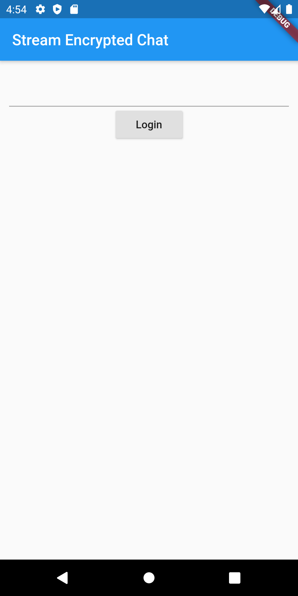
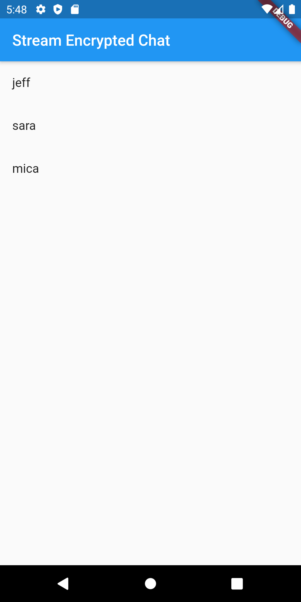
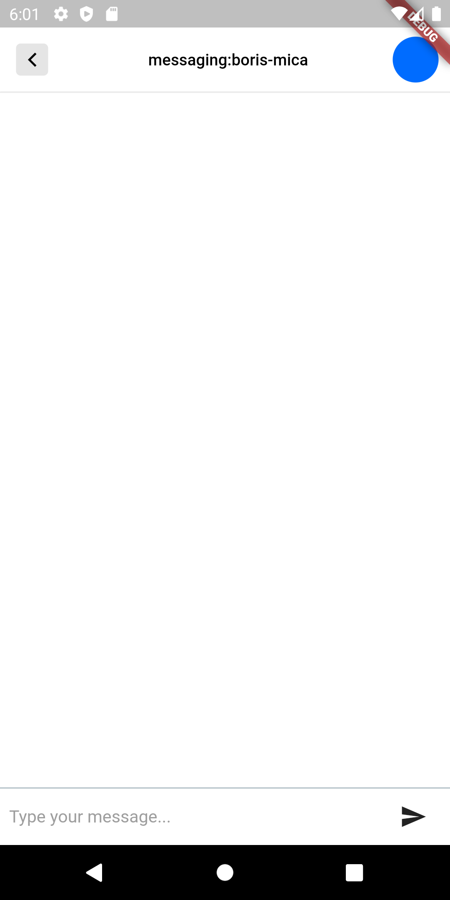
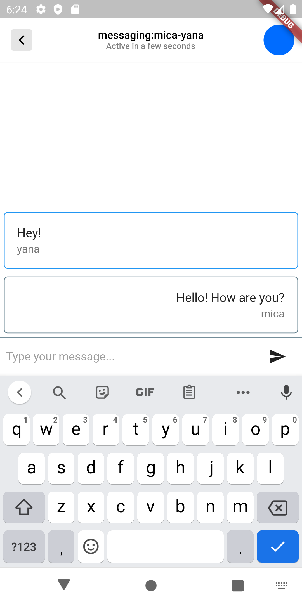

# Stream Flutter Encrypted Chat

In this tutorial, we'll build encrypted chat on iOS and Android using Flutter. We'll combine Stream Chat and Virgil Security. Both Stream Chat and Virgil make it easy to build a solution with great security with all the features you expect. These two services allow developers to integrate chat that is zero-knowledge. The application embeds Virgil Security's eThree Kit (on [iOS](https://github.com/VirgilSecurity/virgil-sdk-x) and [Android](https://github.com/VirgilSecurity/virgil-sdk-java-android)) with [Stream Chat's Flutter](https://github.com/GetStream/stream-chat-flutter) components. All source code for this application is available on [GitHub](https://github.com/psylinse/stream-flutter-encrypted-chat).

## What is end-to-end encryption?

End-to-end encryption means that messages sent between two people can only be read by them. To do this, the message is encrypted before it leaves a user's device, and can only be decrypted by the intended recipient.

Virgil Security is a vendor that allows us to create end-to-end encryption via public/private key technology. Virgil provides a platform and a platform that allows us to securely create, store, and provide robust end-to-end encryption.

During this tutorial, we will create a Stream Chat app that uses Virgil's encryption to prevent anyone except the intended parties from reading messages. No one in your company, nor any cloud provider you use, can read these messages. Even if a malicious person gained access to the database containing the messages, all they would see is encrypted text, called ciphertext.

## Building an Encrypted Chat Application

To build this application we'll mostly rely on a few libraries from Stream Chat and Virgil (please check out the dependencies in the source to see what versions). Our final product will encrypt text on the device before sending a message. Decryption and verification will both happen in the receiver's device. Stream's Chat API will only see cyphertext, ensuring our user's data is never seen by anyone else, including you.

To accomplish this, the app performs the following process:

* A user authenticates with your backend.
* The user's app requests a Stream auth token and API key from the `backend`. The
   Flutter app creates a
   [Stream Chat Client](https://getstream.io/chat/docs/#init_and_users) for that user.
* The user's app requests a Virgil auth token from the `backend` and registers
   with Virgil. This generates their private and public key. The private key is stored locally, and the public key is stored in Virgil.
* Once the user decides who they want to chat with the app creates and
   joins a
   [Stream Chat Channel](https://getstream.io/chat/docs/#initialize_channel).
* The app asks Virgil for the receiver's public key.
* The user types a message and sends it to stream. Before sending, the app
   passes the receiver's public key to Virgil to encrypt the message. The message is relayed through Stream Chat to the receiver. Stream receives ciphertext, meaning they can never see the original message.
* The receiving user decrypts the sent message using Virgil. When the message
   is received, app decrypts the message using the Virgil and this is passed along to Stream's React components. Virgil verifies the message is authentic by using the sender's public key.

While this looks complicated, Stream and Virgil do most of the work for us. We'll use Stream's out of the box UI components to render the chat UI and Virgil to do all of the cryptography and key management. We simply combine these services. 

The code is split between the Flutter frontend contained in the `flutter` folder and the Express (Node.js) backend is found in the `backend` folder. See the `README.md` in each folder to see installing and running instructions. If you'd like to follow along with running code, make sure you get both the `backend` and `flutter` running before continuing.

Let's walk through and look at the important code needed for each step.

## Prerequisites

Basic knowledge of Flutter, Android (Kotlin), iOS (Swift), and Node.js is required to follow this tutorial. This code is intended to run locally on your machine. 

You will need an account with [Stream](https://getstream.io/accounts/signup/) and [Virgil](https://dashboard.virgilsecurity.com/signup). Once you've created your accounts, you can place your credentials in `backend/.env` if you'd like to run the code. You can use `backend/.env.example` as a reference for what credentials are required. You also need to set up ngrok in `backend_service.dart` or something similar if you'd like to run it on iOS.

## Step 0. Setup the Backend

For our Flutter app to securely interact with Stream and Virgil, the
the `backend` provides three endpoints:

* `POST /v1/authenticate`: This endpoint generates an auth token that allows the
  React frontend to communicate with the other endpoints. To keep things simple, this endpoint allows the client to be any user. The frontend tells the backend who it wants to authenticate as. In your application, this should be replaced with real authentication appropriate for your app.

* `POST /v1/stream-credentials`: This returns the data required for the Flutter app to establish a session with Stream. In order return this info we need to tell Stream this user exists and ask them to create a valid auth token:
  
  ```javascript
  // backend/src/controllers/v1/stream-credentials.js
  exports.streamCredentials = async (req, res) => {
    const data = req.body;
    const apiKey = process.env.STREAM_API_KEY;
    const apiSecret = process.env.STREAM_API_SECRET;
  
    const client = new StreamChat(apiKey, apiSecret);
  
    const user = Object.assign({}, data, {
      id: `${req.user.sender}`,
      role: 'admin',
      image: `https://robohash.org/${req.user.sender}`,
    });
    const token = client.createToken(user.id);
    await client.updateUsers([user]);
    res.status(200).json({ user, token, apiKey });
  }
  ```
  
  The response payload has this shape:
  
  ```json
  {
    "apiKey": "<string>",
    "token": "<string>",
    "user": {
      "id": "<string>",
      "role": "<string>",
      "image": "<string>"
    }
  } 
  ```
  
   * `apiKey` is the stream account identifier for your Stream instance. Needed to identify what account your frontend is trying to connect with.
   * `token` JWT token to authorize the frontend with Stream.
   * `user`: This object contains the data that the frontend needs to connect and render the user's view.

* `POST /v1/virgil-credentials`: This returns the authentication token used to connect the frontend to Virgil. We use the Virgil Crypto SDK to generate a valid auth token for us:
  
  ```javascript
  // backend/src/controllers/v1/virgil-credentials.js
  async function getJwtGenerator() {
    await initCrypto();
  
    const virgilCrypto = new VirgilCrypto();
    // initialize JWT generator with your App ID and App Key ID you got in
    // Virgil Dashboard.
    return new JwtGenerator({
      appId: process.env.VIRGIL_APP_ID,
      apiKeyId: process.env.VIRGIL_KEY_ID,
      apiKey: virgilCrypto.importPrivateKey(process.env.VIRGIL_PRIVATE_KEY),
      accessTokenSigner: new VirgilAccessTokenSigner(virgilCrypto)
    });
  }
  
  const generatorPromise = getJwtGenerator();
  
  exports.virgilCredentials = async (req, res) => {
    const generator = await generatorPromise;
    const virgilJwtToken = generator.generateToken(req.user.sender);
  
    res.json({ token: virgilJwtToken.toString() });
  };
  ```
  
  In this case, the frontend only needs the auth token.

* `GET /v1/users`: Endpoint for returning all users. This exists just to get a list of people to chat with. 


## Step 1. User Authenticates With Backend

The first step is to authenticate a user and get our Stream and Virgil credentials. To keep thing simple, we'll have a simple form that allows you to log in as anyone:



This simple form takes an arbitary user name and logs that user in (the backend will create the user and register them with Stream/Virgil if necessary). We set this up in `main.dart`:

```dart
// flutter/lib/main.dart:29
class _StreamEncryptedChatDemoState extends State<StreamEncryptedChatDemo> {
  final _userController = TextEditingController();
  Account _account;

  Future _login(BuildContext context) async {
    // ...
  }

  @override
  Widget build(BuildContext context) {
    var body;
    if (_account != null) {
      body = Users(account: _account);
    } else {
      body = Container(
        padding: EdgeInsets.all(12.0),
        child: Center(
          child: Column(
            children: [
              TextField(
                controller: _userController,
              ),
              RaisedButton(
                onPressed: () => _login(context),
                child: Text("Login"),
              ),
            ],
          ),
        ),
      );
    }
    return Scaffold(
      appBar: AppBar(
        title: Text("Stream Encrypted Chat"),
      ),
      body: body,
    );
  }
}
```

If we're not logged in (account is null), we'll show the login screen. When the user types a name and clicks `Login` we authenticate the user against the backend and set up everything we'll need later:

```dart
// flutter/lib/main.dart:33
Future _login(BuildContext context) async {
  if (_userController.text.length > 0) {
    var user = _userController.text;

    var credentials = await backend.login(user);

    final client = Client(credentials['streamApiKey'], logLevel: Level.INFO);
    await client.setUser(User(id: user), credentials['streamToken']);

    await virgil.init(user, credentials['virgilToken']);

    setState(() {
      _account = Account(
        user: user,
        authToken: credentials['authToken'],
        streamClient: client,
      );
    });
  } else {
    Scaffold.of(context).showSnackBar(
      SnackBar(
        content: Text('Invalid User'),
      ),
    );
  }
}
```

We log in with the backend, via `backend.login`. We use those credentials to initialize our Stream `Client` with the user and initialize Virgil. We store the results in our `_account` instance variable which allows us to boot the `Users` screen. Before we look at our list of users to chat with, let's check out `backend.login` and `virgil.init`. 

First let's look at `backend_service.dart`:

```dart
// flutter/lib/services/backend_service.dart:5
final BackendService backend = BackendService._singleton();

class BackendService {
  BackendService._singleton();

  String authToken;
  String streamToken;
  String streamApiKey;
  String virgilToken;

  // android only, for both platforms use something like: https://ngrok.com/
  static const _baseUrl = 'http://10.0.2.2:8080';

  Future<Map<String, String>> login(String user) async {
    var authResponse =
        await http.post('$_baseUrl/v1/authenticate', body: {'user': user});
    authToken = json.decode(authResponse.body)['authToken'];

    var streamResponse = await http.post('$_baseUrl/v1/stream-credentials',
        headers: {'Authorization': 'Bearer $authToken'});
    var streamBody = json.decode(streamResponse.body);
    streamToken = streamBody['token'];
    streamApiKey = streamBody['apiKey'];

    var virgilResponse = await http
        .post('$_baseUrl/v1/virgil-credentials', headers: {'Authorization': 'Bearer $authToken'});
    virgilToken = json.decode(virgilResponse.body)['token'];

    return {
      'authToken': authToken,
      'streamToken': streamToken,
      'streamApiKey': streamApiKey,
      'virgilToken': virgilToken,
    };
  }
  
  //...
}
```

The `backend` variable is a singleton service that knows how to coordinate with the backend API. The login method performs three steps to get all the necessary credentials. First, it authenticates against the API to get an auth token. Using the auth token, it asks for a Stream frontend token and Virgil frontend token. These frontend tokens allow our Flutter application to communicate directly with Stream and Virgil without going through our backend.

Last let's look at how we initialize Virgil via `virgil.init`:

```dart
// flutter/lib/services/virgil_service.dart:3
final VirgilService virgil = VirgilService._singleton();

class VirgilService {
  VirgilService._singleton();

  static const virgilChannel = const MethodChannel('io.getstream/virgil');

  Future init(String user, String virgilToken) async {
    return await virgilChannel.invokeMethod<bool>('initVirgil', {'user': user, 'token': virgilToken});
  }
  
  //...
}
```

Since Virgil doesn't supply a Flutter SDK, we need to use native code for both iOS and Android. We use Flutter's [platform channels](https://flutter.dev/docs/development/platform-integration/platform-channels) to call to native code. First, let's look at our Android implementation:

```kotlin
// flutter/android/app/src/main/kotlin/io/getstream/encryptedchat/MainActivity.kt:16
class MainActivity : FlutterActivity(), CoroutineScope by MainScope() {
  private val CHANNEL = "io.getstream/virgil"
  private var eThree: EThree? = null

  override fun configureFlutterEngine(@NonNull flutterEngine: FlutterEngine) {
    GeneratedPluginRegistrant.registerWith(flutterEngine);
    MethodChannel(flutterEngine.dartExecutor.binaryMessenger, CHANNEL).setMethodCallHandler { call, result ->
      when (call.method) {
        "initVirgil" -> {
          initVirgil(call.argument<String>("token")!!, result)
        }
        // ...
      }
    }
  }

  private fun initVirgil(token: String, result: MethodChannel.Result) {
    eThree = EThree.initialize(context, object : OnGetTokenCallback {
      override fun onGetToken() = token
    }).get()

    launch(Dispatchers.IO) {
      try {
        eThree!!.register().execute()
      } catch (e: RegistrationException) {
        // already registered
      }
      launch(Dispatchers.Main) {
        result.success(true)
      }
    }
  }

  // ...
}
```

Virgil's client is called `EThree`. We initialize an `EThree` instance and register. This call generates a private key and stores it on the device and sends our public key to Virgil. If we get a `RegistrationException` we have already registered this user. Keep in mind, you can't log into the same user on a different device since we're not sharing the private key with the other device! This is possible, but out of scope for this tutorial. If you'd like to accomplish this, see Virgil's [documentation](https://developer.virgilsecurity.com/docs/e3kit/multi-device-support/). Note, the Virgil token will expire, so in a production application you need to provide a more robust `OnGetTokenCallback`. If the token expires, simply restart the app and log in.

Here is the Swift implementation, which does the same thing on iOS:

```swift
// flutter/ios/Runner/AppDelegate.swift:6
@UIApplicationMain
@objc class AppDelegate: FlutterAppDelegate {
    var eThree: EThree?
    
    override func application(
        _ application: UIApplication,
        didFinishLaunchingWithOptions launchOptions: [UIApplication.LaunchOptionsKey: Any]?
    ) -> Bool {
        
        let controller : FlutterViewController = window?.rootViewController as! FlutterViewController
        let virgilChannel = FlutterMethodChannel(name: "io.getstream/virgil",
                                                 binaryMessenger: controller.binaryMessenger)
        virgilChannel.setMethodCallHandler({
            [weak self] (call: FlutterMethodCall, result: @escaping FlutterResult) -> Void in
            let args = call.arguments as!  Dictionary<String, String>
            if call.method == "initVirgil" {
                do {
                    try self!.initVirgil(args: args, result: result)
                } catch let error {
                    result(FlutterError.init(code: "IOS_EXCEPTION_initVirgil",
                                             message: error.localizedDescription,
                                             details: nil))
                }
            // ... 
            } else {
                result(FlutterError.init(code: "IOS_EXCEPTION_NO_METHOD_FOUND",
                                         message: "no method found for: " + call.method,
                                         details: nil));
            }
        })
        
        GeneratedPluginRegistrant.register(with: self)
        return super.application(application, didFinishLaunchingWithOptions: launchOptions)
    }
    
    
    private func initVirgil(args: Dictionary<String, String>, result: FlutterResult) {
        let tokenCallback: EThree.RenewJwtCallback = { completion in
            completion(args["token"]!, nil)
        }
        eThree = try! EThree(identity: args["user"]!, tokenCallback: tokenCallback)
        
        eThree!.register { error in
            if let error = error {
                if error as? EThreeError == .userIsAlreadyRegistered {
                    print("Already registered")
                } else {
                    print("Failed registering: \(error.localizedDescription)")
                }
            }
        }
        
        result(true)
    }
    
    //...
}
```

Now that we've initialized Stream and Virgil let's find a user to chat with!

## Step 2: List Users

To keep things simple, we'll get all registered users from our backend and display them in a list:



Here's the widget code:

```dart
// flutter/lib/users.dart:7
class Users extends StatefulWidget {
  Users({Key key, @required this.account}) : super(key: key);

  final Account account;

  @override
  _UsersState createState() => _UsersState();
}

class _UsersState extends State<Users> {
  Future<List> _users;

  @override
  void initState() {
    super.initState();
    _users = backend.users();
  }

  @override
  Widget build(BuildContext context) {
    return FutureBuilder<List>(
      future: _users,
      builder: (BuildContext context, AsyncSnapshot<List> snapshot) {
        if (!snapshot.hasData) {
          return Center(child: CircularProgressIndicator());
        }

        return ListView(
          children: snapshot.data
              .where((u) => u != widget.account.user)
              .map(
                (user) => ListTile(
                  title: Text(user),
                  onTap: () {
                    Navigator.push(
                      context,
                      MaterialPageRoute(
                        builder: (_) => Chat(
                          account: widget.account,
                          otherUser: user,
                        ),
                      ),
                    );
                  },
                ),
              )
              .toList(),
        );
      },
    );
  }
}
```

We use a `FutureBuilder` backed with a Future from our call to `backend.users()`. This will display a loader until the users Future completes when it displays the list. 

Let's look at our `backend.users()` method:

```dart
// flutter/lib/services/backend_service.dart:39
Future<List> users() async {
  var response = await http.get('$_baseUrl/v1/users', headers: {'Authorization': 'Bearer $authToken'});
  return json.decode(response.body);
}
```

This is a simple request to the `backend` to get our list of users. When a user clicks on another user, we push a new route that is a `Chat` widget. 

## Step 3: Create a Private 1-on-1 Chat Channel

First, we need to create our channel for our private chat. Let's look at how the `Chat` widget is laid out:

```dart
// flutter/lib/chat.dart:7
class Chat extends StatefulWidget {
  Chat({Key key, @required this.account, @required this.otherUser})
      : super(key: key);

  final Account account;
  final String otherUser;

  @override
  _ChatState createState() => _ChatState();
}

class _ChatState extends State<Chat> {
  // ...
  @override
  Widget build(BuildContext context) {
    return StreamChat(
      client: widget.account.streamClient,
      child: StreamChannel(
        channel: _channel,
        child: Scaffold(
          appBar: ChannelHeader(
            onBackPressed: () {
              Navigator.of(context).pop();
            },
          ),
          body: Column(
            children: <Widget>[
              Expanded(
                child: MessageListView(
                  messageBuilder: _messageBuilder,
                ),
              ),
              buildInput(context),
            ],
          ),
        ),
      ),
    );
  }
}
```

Here we use Stream's Flutter components, `StreamChat`, `StreamChannel`, `ChannelHeader`, and `MessageListView` to build most of the UI for us. We feed the `StreamChat` widget the `StreamClient` which provides that instance to any Stream widget below it in the widget tree. Wired up correctly, the entire chat view is built for us by Stream's Flutter library.

We also provide the `StreamChannel` widget our `_channel` instance. We initialize this in the `initState` method:

```dart
// flutter/lib/chat.dart:23
@override
void initState() {
  super.initState();

  var users = [widget.account.user, widget.otherUser];
  users.sort();
  var channelId = users.join("-");
  _channel = widget.account.streamClient.channel(
    'messaging',
    id: channelId,
    extraData: {'members': users},
  );

  _channel.watch();
}
```

We use the two user's names to create a unique channel id and ensure those users are members of the channel. Once `_channel.watch()` is called, the channel is created in Stream and we've indicated we'd like to watch for future messages. 

With our channel created, we can send our first encrypted message.

## Step 4: Sending an Encrypted Message

Looking at our `build` method, you'll see a `buildInput` call, which generates our input widget:

```dart
// flutter/lib/chat.dart:47
Widget buildInput(BuildContext context) {
  return Container(
    margin: EdgeInsets.only(bottom: MediaQuery
        .of(context)
        .padding
        .bottom),
    child: Row(
      children: <Widget>[
        // Edit text
        Flexible(
          child: Container(
            padding: EdgeInsets.symmetric(horizontal: 8.0),
            child: TextField(
              style: TextStyle(fontSize: 15.0),
              controller: _messageController,
              decoration: InputDecoration.collapsed(
                hintText: 'Type your message...',
                hintStyle: TextStyle(color: Colors.grey),
              ),
            ),
          ),
        ),

        Material(
          child: Container(
            margin: EdgeInsets.symmetric(horizontal: 8.0),
            child: IconButton(
              icon: Icon(Icons.send),
              onPressed: _sendMessage,
            ),
          ),
          color: Colors.white,
        ),
      ],
    ),
    width: double.infinity,
    height: 50.0,
    decoration: BoxDecoration(
      border: Border(top: BorderSide(color: Colors.blueGrey, width: 0.5)),
      color: Colors.white,
    ),
  );
}
```

This looks complicated, but it's just layout code that generates a simple input box with a send button, which you can see at the bottom:



We do the real work in `sendMessage` which is called when a user clicks on the send button:

```dart
// flutter/lib/chat.dart:39
Future<void> _sendMessage() async {
  if (_messageController.text.length > 0) {
    var encryptedText = await virgil.encrypt(widget.otherUser, _messageController.text);
    _channel.sendMessage(Message(text: encryptedText));
    _messageController.clear();
  }
}
```

We use our Virgil service to encrypt the message before sending it to Stream's library code via `_channel.sendMessage`. Since this is native, we simply call the platform channel:

```dart
// flutter/lib/services/virgil_service.dart:14
Future<String> encrypt(String user, String text) async {
  return await virgilChannel.invokeMethod<String>('encrypt', {'otherUser': user, 'text': text});
}
```

Which, on Android, looks like:

```kotlin
// flutter/android/app/src/main/kotlin/io/getstream/encryptedchat/MainActivity.kt:16
class MainActivity : FlutterActivity(), CoroutineScope by MainScope() {
  private val CHANNEL = "io.getstream/virgil"
  private var eThree: EThree? = null

  override fun configureFlutterEngine(@NonNull flutterEngine: FlutterEngine) {
    GeneratedPluginRegistrant.registerWith(flutterEngine);
    MethodChannel(flutterEngine.dartExecutor.binaryMessenger, CHANNEL).setMethodCallHandler { call, result ->
      when (call.method) {
        // ...
        "encrypt" -> {
          encrypt(
            call.argument<String>("otherUser")!!,
            call.argument<String>("text")!!,
            result
          )
        }
        // ...
      }
    }
  }

  //...

  private fun encrypt(otherUser: String, text: String, result: MethodChannel.Result) {
    launch(Dispatchers.IO) {
      val publicKeys = eThree!!.lookupPublicKeys(otherUser).get()
      val encryptedText = eThree!!.encrypt(text, publicKeys)

      launch(Dispatchers.Main) {
        result.success(encryptedText)
      }
    }
  }
  
  //...
}
```

Using Virgil's `EThree` we look up the other user's public key and use it to encrypt the text. We pass the result back to Flutter. 

The same thing happens in Swift:

```swift
// flutter/ios/Runner/AppDelegate.swift:6
@UIApplicationMain
@objc class AppDelegate: FlutterAppDelegate {
    var eThree: EThree?
    
    override func application(
        _ application: UIApplication,
        didFinishLaunchingWithOptions launchOptions: [UIApplication.LaunchOptionsKey: Any]?
    ) -> Bool {
        
        let controller : FlutterViewController = window?.rootViewController as! FlutterViewController
        let virgilChannel = FlutterMethodChannel(name: "io.getstream/virgil",
                                                 binaryMessenger: controller.binaryMessenger)
        virgilChannel.setMethodCallHandler({
            [weak self] (call: FlutterMethodCall, result: @escaping FlutterResult) -> Void in
            let args = call.arguments as!  Dictionary<String, String>
            if call.method == "initVirgil" {
                // ...
            } else if call.method == "encrypt" {
                do {
                    self!.encrypt(args: args, result: result)
                } catch let error {
                    result(FlutterError.init(code: "IOS_EXCEPTION_encrypt",
                                             message: error.localizedDescription,
                                             details: nil))
                }
            // ...
            } else {
                result(FlutterError.init(code: "IOS_EXCEPTION_NO_METHOD_FOUND",
                                         message: "no method found for: " + call.method,
                                         details: nil));
            }
        })
        
        GeneratedPluginRegistrant.register(with: self)
        return super.application(application, didFinishLaunchingWithOptions: launchOptions)
    }
    
    // ...
    
    private func encrypt(args: Dictionary<String, String>, result: @escaping FlutterResult) {
        eThree!.findUser(with: args["otherUser"]!) { card, _ in
            let encryptedText: String = try! self.eThree!.authEncrypt(text: args["text"]!, for: card!)
            
            result(encryptedText)
        }
    }
    
    // ...
}
```

Now that we can encrypt a message and send it, let's see how we decrypt those messages.

## Step 5: Decrypting and Viewing Messages

As seen above, in our `Chat` widgets `build` method, we hook into Stream's `MessageListView` by passing a custom message builder. Let's see what this message builder does:

```dart
// flutter/lib/chat.dart:91
Widget _messageBuilder(context, message, _) {
  return EncryptedMessage(message: message);
}
```

We simply initialize a custom `EncryptedMessage` widget that takes that message, decrypts and displays it. Here's the implementation of `EncryptedMessage`:

```dart
// flutter/lib/encrypted_message.dart:6
class EncryptedMessage extends StatefulWidget {
  EncryptedMessage({Key key, @required this.message}) : super(key: key);

  final Message message;

  @override
  _EncryptedMessageState createState() => _EncryptedMessageState();
}

class _EncryptedMessageState extends State<EncryptedMessage> {
  bool isMine;
  String _text;

  @override
  void initState() {
    isMine = StreamChat.of(context).user.id == widget.message.user.id;

    decryptText().then((text) {
      setState(() {
        _text = text;
      });
    });
    super.initState();
  }

  Future<String> decryptText() async {
    if (isMine) {
      return virgil.decryptMine(widget.message.text);
    } else {
      return virgil.decryptTheirs(widget.message.user.id, widget.message.text);
    }
  }

  @override
  Widget build(BuildContext context) {
    if (_text != null) {
      final textAlign = isMine ? TextAlign.right : TextAlign.left;
      final color = isMine ? Colors.blueGrey : Colors.blue;

      return Padding(
        padding: EdgeInsets.all(5.0),
        child: Container(
          decoration: BoxDecoration(
            border: Border.all(color: color, width: 1),
            borderRadius: BorderRadius.all(
              Radius.circular(5.0),
            ),
          ),
          child: ListTile(
            title: Text(
              _text,
              textAlign: textAlign,
            ),
            subtitle: Text(
              widget.message.user.id,
              textAlign: textAlign,
            ),
          ),
        ),
      );
    } else {
      return Container();
    }
  }
}
```

This widget determines which user the message is from and calls `virgil.decryptMine` or `virgil.decryptTheirs`. Using the result from one of these calls, it sets the text and does a simple message layout (you can build any message view you want!). 

Like before, the Flutter side are simple platform channel calls:

```dart
// flutter/lib/services/virgil_service.dart:18
Future<String> decryptMine(String text) async {
  return await virgilChannel.invokeMethod<String>('decryptMine', {'text': text});
}

Future<String> decryptTheirs(String otherUser, String text) async {
  return await virgilChannel.invokeMethod<String>('decryptTheirs', {'text': text, 'otherUser': otherUser});
}
```

Let's look at our Android implemenation:

```kotlin
// flutter/android/app/src/main/kotlin/io/getstream/encryptedchat/MainActivity.kt:78
private fun decryptMine(text: String, result: MethodChannel.Result) {
  result.success(eThree!!.decrypt(text))
}

private fun decryptTheirs(text: String, otherUser: String, result: MethodChannel.Result) {
  launch(Dispatchers.IO) {
    val publicKey = eThree!!.lookupPublicKeys(otherUser).get()[otherUser]
    launch(Dispatchers.Main) {
      result.success(eThree!!.decrypt(text, publicKey))
    }
  }
}
```

If the message is ours, then we can simply decrypt since we have everything we need to do so on the device. If the message is theirs, we need to look up their public key first, then use that key to verify the decrypted message is authentic. 

Here's the Swift side:

```swift
// flutter/ios/Runner/AppDelegate.swift:90
private func decryptMine(args: Dictionary<String, String>, result: FlutterResult) {
    let decryptedText = try! eThree!.authDecrypt(text: args["text"]!)
    result(decryptedText)
}

private func decryptTheirs(args: Dictionary<String, String>, result: @escaping FlutterResult) {
    eThree!.findUser(with: args["otherUser"]!) { card, _ in
        let encryptedText: String = try! self.eThree!.authDecrypt(text: args["text"]!, from: card!)
        
        result(encryptedText)
    }
}

```

Typing a view messages on both sides will give a view like this:




And we're done! We have full end-to-end encryption using Stream and Virgil in Flutter.
